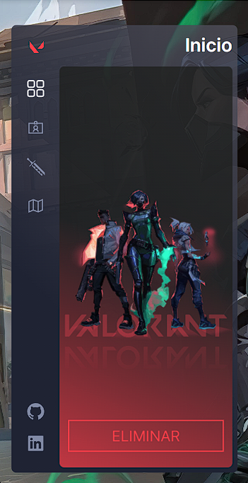
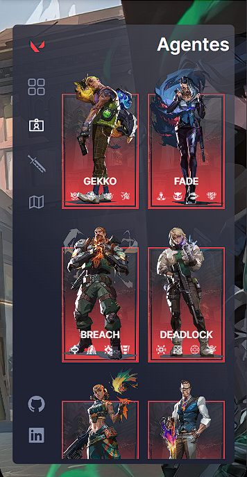
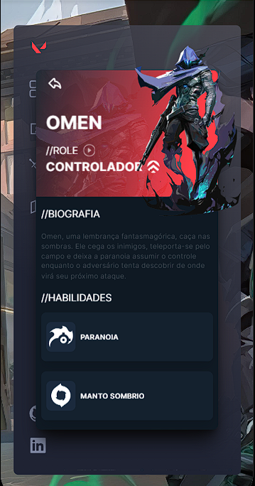
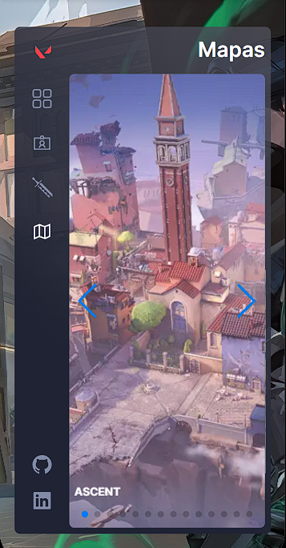
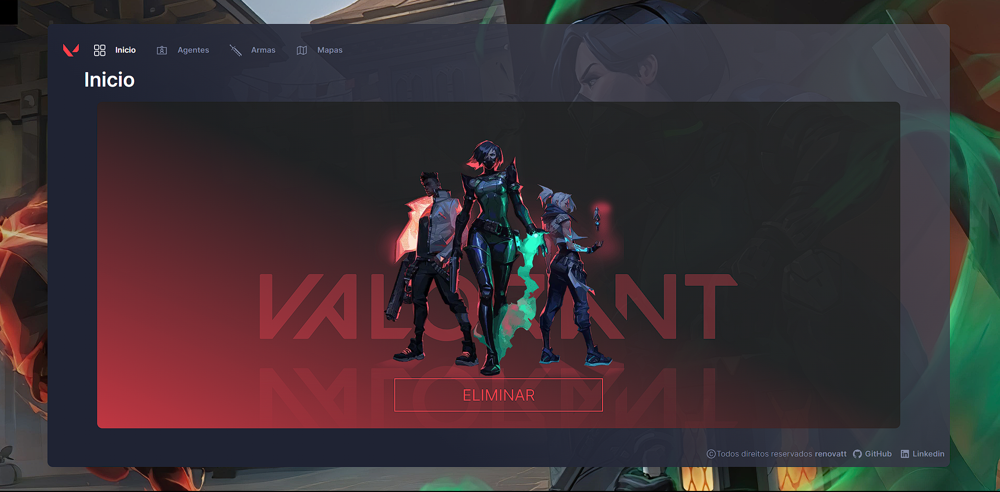
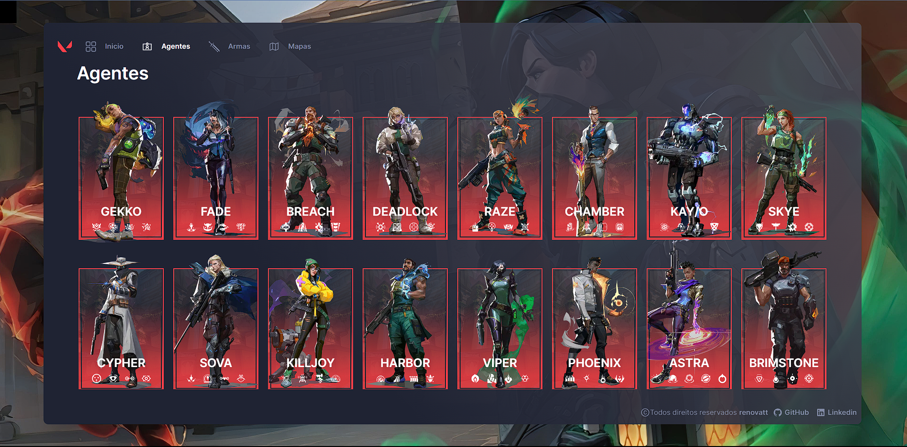
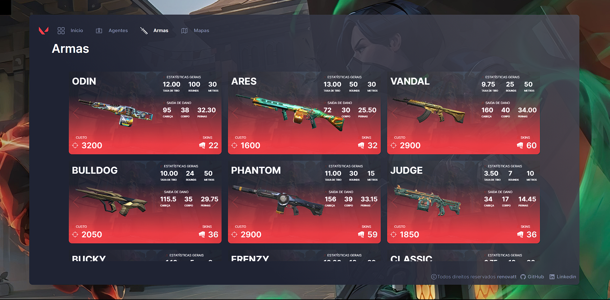
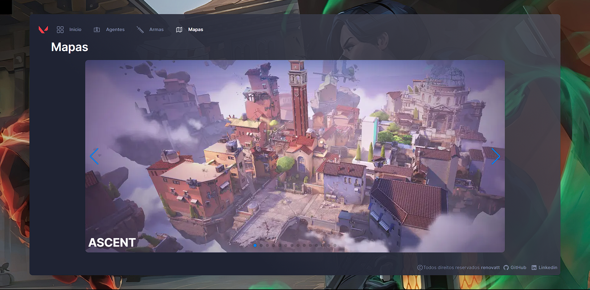

</h1>
   
<h1>Valorant</h1> 

## Bem-vindo ao Valorant App!

### Sua principal fonte de informações sobre o fascinante universo de Valorant. Este projeto, cuidadosamente elaborado e impulsionado por paixão, é um recurso completo tanto para jogadores veteranos quanto para novatos, todos em busca de aprimorar suas habilidades e mergulhar profundamente no mundo de Valorant.

### É com grande satisfação que apresento este projeto, que transcende o simples consumo de uma API. Ele representa um marco em minha jornada de aperfeiçoamento contínuo. Originado a partir de um projeto inicial durante meus primeiros passos na programação, o [Valorant App](https://valorant-renovatt.vercel.app/) evoluiu para uma versão completamente otimizada e elegantemente desenvolvida. Explorei o design e aprimorei as animações para proporcionar uma experiência de usuário incomparável.

### Dentro deste aplicativo, você encontrará informações abrangentes sobre todos os personagens do jogo, incluindo suas habilidades e até suas vozes distintas. Além disso, oferecemos um catálogo completo de armas, com detalhes sobre estatísticas e skins disponíveis. Não deixamos de fora os mapas estratégicos que são essenciais para o sucesso em Valorant.

### Vale a pena ressaltar que cada personagem tem sua própria rota, criada pelo Next.js, com URLs dinâmicas e SEO individualizado, garantindo que os jogadores tenham acesso a informações precisas e relevantes.

### Utilizamos várias bibliotecas para estilização e criação de slides, juntamente com o Zustand, que desempenha um papel fundamental em nossa aplicação.

### Recursos Destacados:

- **Detalhes de Armas:** Explore um catálogo completo de armas, incluindo estatísticas e skins disponíveis.

- **Agentes em Profundidade:** Conheça cada Agente em Valorant, com biografias, habilidades e vozes exclusivas.

- **Mapas Estratégicos:** Domine todos os mapas do jogo e ganhe vantagem competitiva.

- **Design Apaixonado:** Desenvolvemos este projeto com um design elegante e intuitivo, proporcionando uma experiência de usuário envolvente e informativa.

 

[Ver Projeto](https://valorant-renovatt.vercel.app/)

#

## Layout mobile

## Layout web
 

## 🛠️ Tecnologias

💻 **Front-end**
- [Next.js 13.4](https://nextjs.org)
- [Typescript](https://www.typescriptlang.org)

📚 **Bibliotecas**
- [zustand](https://zustand-demo.pmnd.rs/)
- [react-query](https://tanstack.com/query/latest/docs/react/overview)
- [next-pwa](https://www.npmjs.com/package/next-pwa)
- [swiper](https://swiperjs.com/)
- [react-icons](https://react-icons.github.io/react-icons/)
- [aos](https://michalsnik.github.io/aos/)
- [animate-css](https://animate.style/)

🎨 **Estilização**
- [tailwindcss](https://tailwindcss.com/docs/installation)

🔋 **Versionamento e Deploy**
- [Git](https://git-scm.com)
- [Vercel](https://vercel.com/)

 

⚙️ **Configuranções e Instalações**

Clone do Projeto

    $ git clone https://github.com/renovatt/valorant.git

Instalando as dependências

    $ npm install

Iniciando o projeto

    $ npm run dev

 

**Como contribuir?**

- Você pode dar suporte me seguindo aqui no GitHub
- Dando uma estrela no projeto
- Criar uma conexão comigo no linkedin fazendo parte da minha networking e curtir o meu projeto.

 

**Autor**
[Wildemberg Renovato de Lima](https://www.linkedin.com/in/renovatt/)