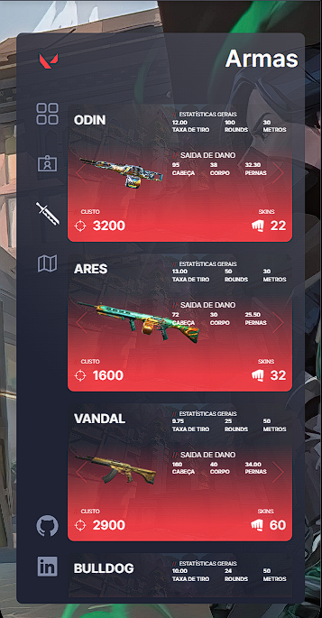
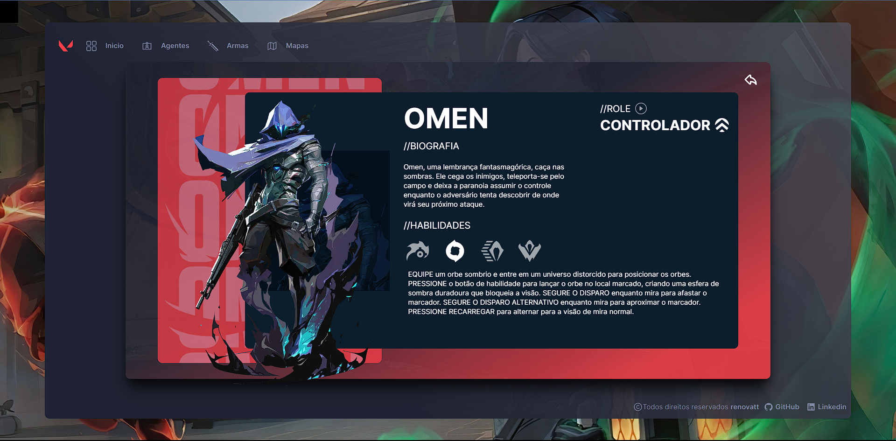

</h1>
   
<h1>Valorant</h1> 

## Descrição

### Bem-vindo ao ValorantHub, a sua fonte definitiva de informações sobre o mundo do jogo Valorant. Este projeto apaixonado e meticulosamente desenvolvido é um recurso completo para jogadores, entusiastas e novatos que desejam aprimorar sua experiência em Valorant.

### Recursos Destacados:

**Armas Detalhadas:** Explore um catálogo completo de armas, com estatísticas e skins.

**Agentes em Profundidade:** Conheça cada Agente em Valorant, com biografias, habilidades e vozes.

**Mapas Estratégicos**: Domine todos os mapas do jogo.

**Design Apaixonado:** Desenvolvi este projeto com um design elegante e intuitivo para proporcionar uma experiência de usuário envolvente e informativa.

[Ver Projeto](https://valorant-renovatt.vercel.app/)

#

## Layout mobile

## Layout web
 

## 🛠️ Tecnologias

💻 **Front-end**
- [Next.js 13.4](https://nextjs.org)
- [Typescript](https://www.typescriptlang.org)

📚 **Bibliotecas**
- [zustand](https://zustand-demo.pmnd.rs/)
- [react-query](https://tanstack.com/query/latest/docs/react/overview)
- [next-pwa](https://www.npmjs.com/package/next-pwa)
- [swiper](https://swiperjs.com/)
- [react-icons](https://react-icons.github.io/react-icons/)
- [aos](https://michalsnik.github.io/aos/)
- [animate-css](https://animate.style/)

🎨 **Estilização**
- [tailwindcss](https://tailwindcss.com/docs/installation)

🔋 **Versionamento e Deploy**
- [Git](https://git-scm.com)
- [Vercel](https://vercel.com/)

 

⚙️ **Configuranções e Instalações**

Clone do Projeto

    $ git clone https://github.com/renovatt/valorant.git

Instalando as dependências

    $ npm install

Iniciando o projeto

    $ npm run dev

 

**Como contribuir?**

- Você pode dar suporte me seguindo aqui no GitHub
- Dando uma estrela no projeto
- Criar uma conexão comigo no linkedin fazendo parte da minha networking e curtir o meu projeto.

 

**Autor**
[Wildemberg Renovato de Lima](https://www.linkedin.com/in/renovatt/)